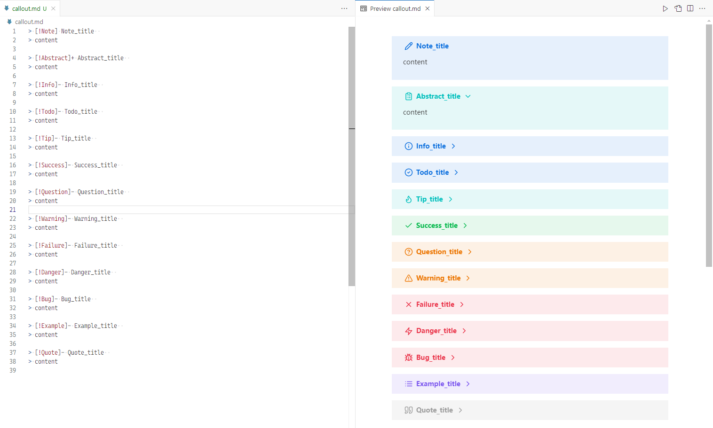

# Markdown Obsidian Callout

## What is this

This is a plugin for VS Code which adds support for [Obsidian](https://obsidian.md/) callouts in VS Code's built-in markdown preview.

## References

- [antfu/markdown-it-github-alerts](https://github.com/antfu/markdown-it-github-alerts)
- [KosmosisDire/obsidian-webpage-export](https://github.com/KosmosisDire/obsidian-webpage-export)
